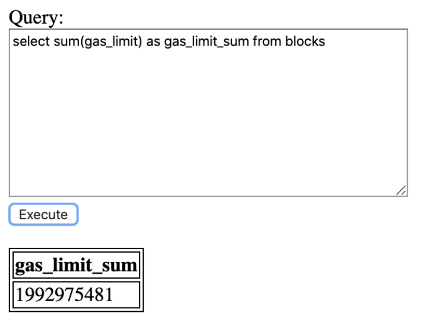

# Dune Analytics assignment 
## Basic Query Executor
In few words, Query Executor runs SELECT queries on top of the PostgreSQL database, specifically BLOCKS table.

The structure of the BLOCKS table is the following:

```
TABLE blocks (
     "time" timestamp with time zone NOT NULL,
     number numeric NOT NULL,
     hash bytea NOT NULL,
     parent_hash bytea NOT NULL,
     gas_limit numeric NOT NULL,
     gas_used numeric NOT NULL,
     miner bytea NOT NULL,
     difficulty numeric NOT NULL,
     total_difficulty numeric NOT NULL,
     nonce bytea NOT NULL,
     size numeric NOT NULL
)
```
## Project frontend

#### Simple query


#### Aggregate query


#### How To Run This Project


